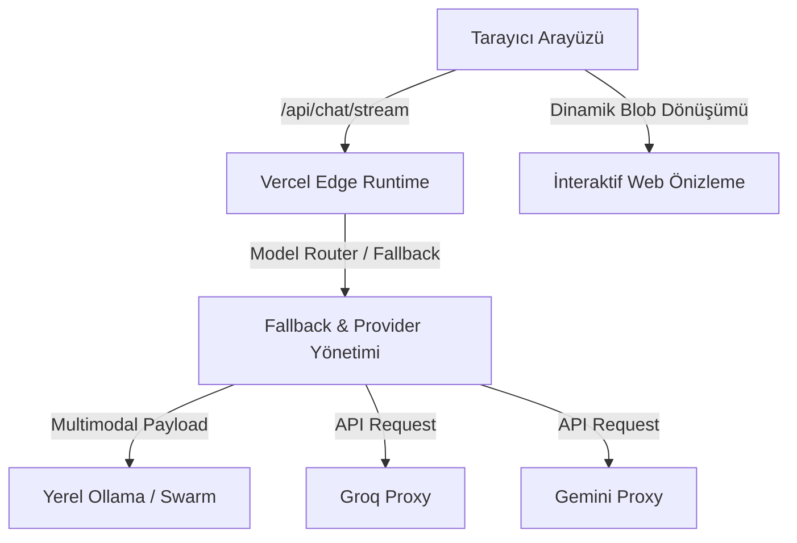

<div align="center">

# 🌌 GaziGPT

<p align="center">
  
  =18.0.0-green?style=for-the-badge&logo=node.js" alt="Node Version">
  
  
</p>

**GaziGPT**, zengin özelliklerle donatılmış premium karanlık arayüzü, gelişmiş çoklu yapay zeka yönlendirme motoru ve dinamik web projeleri geliştirebilen eş zamanlı önizleme yeteneklerine sahip yeni nesil bir yapay zeka asistanı platformudur.

[Özellikler](#-özellikler) • [Mimari Yapı](#-mimari-yapı) • [Kurulum](#-kurulum) • [Teknoloji Seti](#-teknoloji-seti)

</div>

---

## 🚀 Özellikler

### 🎭 Akıllı Model Katmanları
Sistem, kullanıcının ihtiyaçlarına göre optimize edilmiş 3 farklı yapay zeka katmanına sahiptir:

| Katman | Tanım || Hedef Kullanım |
| :--- | :--- | :--- | :--- |
| **⚡ GaziGPT** | Hızlı ve verimli günlük asistan | Pratik sorular, hızlı bilgi edinimi |
| **🧠 Extended** | Uzun ve akıllı bellekli sohbetler | Detaylı analizler, planlama, uzun kodlama |
| **🚀 Hyper** | Derin düşünce ve üst düzey zeka | Karmaşık algoritmalar, üst düzey mantık |

---

### 💻 Proje ve Canlı Önizleme Alanı
GaziGPT, sadece bir sohbet robotu değil, aynı zamanda canlı bir kodlama ortamıdır:
* **Eş Zamanlı Dosya Çıkarma:** Yapay zeka ürettiği HTML, CSS ve JavaScript kod bloklarını algılayarak dosyaları otomatik oluşturur ve günceller.
* **Gelişmiş Önizleme:** Sandboxed iframe teknolojisi sayesinde, `style.css` ve `app.js` gibi statik referansları Blob URL'lerine dönüştürerek yerel olarak tam işlevsellik sağlar.
* **İnteraktif Sohbet:** Doğrudan proje üzerinden talimat vererek web sitenizi adım adım geliştirin.

---

### 🖼️ Çok Modlu (Multimodal) Görsel Akış
Görsel analizlerinde akıllı ve dinamik iki farklı yöntem kullanılır:
1. **Multimodal Doğrudan Geçiş (GaziGPT Hyper):** Ollama veya OllamaSwarm üzerinden GPT-OSS 120B gibi modeller seçildiğinde, görsel başka bir modele analiz ettirilmeden tek istekte doğrudan multimodal payload olarak modele iletilir.
2. **Otomatik Ön Analiz (Standart):** Diğer hafif modellerde, görseller arka planda analiz edilerek metin betimlemesi biçiminde bağlama yerleştirilir.

---

### 🔧 Entegre Yapay Zeka Araçları (Tools)
* **🎨 Görsel Üretimi (`generate_image`):** Flux ve DALL-E modelleriyle promptlarınızı otomatik İngilizceye çevirerek yüksek kaliteli görseller üretir.
* **🎬 Video Üretimi (`generate_video`):** LTX Video API veya tarayıcı tabanlı 3D Parallax motoruyla görselleri hareketli videolara dönüştürür.

---

## 🛠️ Mimari Yapı



---

## 📦 Kurulum ve Çalıştırma

### Gereksinimler
* **Node.js** (v18 veya üzeri sürüm)
* **Local Ollama** (İsteğe bağlı, yerel modelleri çalıştırmak için)

### Adımlar

1. Projeyi yerel bilgisayarınıza indirin ve klasöre girin:
   ```bash
   cd gazigptt
   ```

2. Gerekli paketleri kurun:
   ```bash
   npm install
   ```

3. Geliştirici sunucusunu başlatın:
   ```bash
   npm run dev
   ```
   veya Vercel CLI kurulu ise:
   ```bash
   vercel dev
   ```

4. Tarayıcınızdan **`http://localhost:3000`** adresine gidin.

---

## 🎨 Teknoloji Seti

- **Arayüz (Frontend):** Modern HSL renk paletleri, premium karanlık tema, özel cam efekti (glassmorphic) bileşenler, `highlight.js` (kod renklendirme), `marked.js` (markdown işleme).
- **Sunucu (Backend):** Vercel Edge Functions, Server-Sent Events (SSE) ile gerçek zamanlı akış (streaming), Microsoft Edge TTS (sesli okuma).
- **Hafıza:** LocalStorage tabanlı yerel sohbet geçmişi ve proje veri tabanı yönetimi.

---

<div align="center">
  <p>Gazi AI ekibi tarafından geliştirilmiştir. Geliştirici: <b>Emir Özcan</b></p>
</div>
